# Graph ML on OGBN-Arxiv
> This benchmarks graph neural networks (**GCN**, **ResGCN**, **GraphSAGE**, **GAT**) against a content-only **MLP** baseline on [OGBN-Arxiv](https://ogb.stanford.edu/docs/nodeprop/#ogbn-arxiv): 169,343 CS papers, ~1.16M citation edges (after symmetrization), 40 subject categories. 
Beyond a simple leaderboard comparison, it runs a controlled **ablation** (content-only vs. structure-only vs. content+structure) to isolate *why* graph structure helps, plus **over-smoothing** and **over-squashing** diagnostics to understand *how deep* message passing can go before it stops helping.

```text
              GRAPH MACHINE LEARNING
                       │
                       ▼
                Graph G = (V,E)
                       │
         ┌─────────────┴─────────────┐
         │                           │
   Node features                 Structure
         │                           │
         X                           A
         │                           │
         └─────────────┬─────────────┘
                       │
                       ▼
            GNN / Message Passing
                       │
      ┌────────────────┼────────────────┐
      │                │                │
      ▼                ▼                ▼
     GCN          GraphSAGE            GAT
      │                │                │
Normalisation      Sampling        Attention
du voisinage      + Aggregate      sur voisins
      │                │                │
      └────────────────┼────────────────┘
                       ▼
                Node embeddings
                       │
                       ▼
                Classification
                Link prediction
                Graph prediction
```

---
# Table of contents
- [Installation](#installation)
- [Project structure](#project-structure)
- [Usage](#usage)
  - [1. Explore the data](#1-explore-the-data)
  - [2. Run an experiment](#2-run-an-experiment)
  - [3. Reload a trained model](#3-reload-a-trained-model)
  - [4. Content vs. structure ablation](#4-content-vs-structure-vs-contentstructure)
  - [5. Compare all results](#5-compare-all-results)
  - [Run everything at once](#run-everything-at-once)
- [Results](#results)
- [Implementation notes](#implementation-notes)

---
# Installation
```bash
python -m venv venv
source venv/bin/activate
pip install -r requirements.txt
```

> `torch-geometric` may need a specific install depending on your PyTorch/CUDA version, see the [official install guide](https://pytorch-geometric.readthedocs.io/en/latest/install/installation.html) if `pip install torch-geometric` fails directly.

The dataset (~100 MB) downloads automatically into `./data` on first run.

---
# Project structure
```text
graph_ml_ogbn_arxiv/
├── README.md
├── requirements.txt
├── explore_data.py                # Step 1: graph statistics + visualizations
├── run_experiment.py              # Trains one model (mlp/gcn/resgcn/sage/gat)
├── compare_results.py             # Aggregates results + comparison figures
├── load_checkpoint_example.py     # Reload a saved model and re-evaluate it
├── run_all.sh                     # Runs the whole pipeline in one go
├── src/
│   ├── data.py                    # OGBN-Arxiv loading
│   ├── models.py                  # MLP, GCN, ResGCN, GraphSAGE, GAT
│   └── train.py                   # Training loop, checkpointing, diagnostics
├── checkpoints/                   # Trained model weights (.pt), one per run
└── results/
    ├── results.csv                # Appended after every run
    ├── history/                   # Per-epoch loss/accuracy, one file per run
    ├── diagnostics/               # Over-smoothing / over-squashing metrics per run
    ├── readme/                    # Curated figures embedded in this file
    └── figures/
        ├── exploration/           # Dataset visualizations
        └── comparison/            # Model comparison plots
```

---
# Usage
To launch everything from scratch, run the `run_all.sh` script, which executes the steps below in order (+ more experiments). Otherwise, you can run each step individually, as you wish:
```bash
run_all.sh
```
It will also launch `compare_results.py` at the end to generate the final comparison figures and summary table, detailed in the [Results](#results) section below.

### 1. Explore the data
```bash
python explore_data.py
```
Prints node/edge counts, degree statistics, class distribution, and the graph's **homophily** (fraction of edges connecting two papers of the same category, signal for whether graph structure should help at all).

It also saves figures to `results/figures/exploration/`: degree distribution (linear + log-log), class distribution, degree-by-class, split sizes and two **actual citation subgraphs** drawn with `networkx` (the full 169k-node graph can't be plotted directly): a connected neighborhood sampled around a highly-cited paper and a uniform random sample for contrast.

<p align="center">
  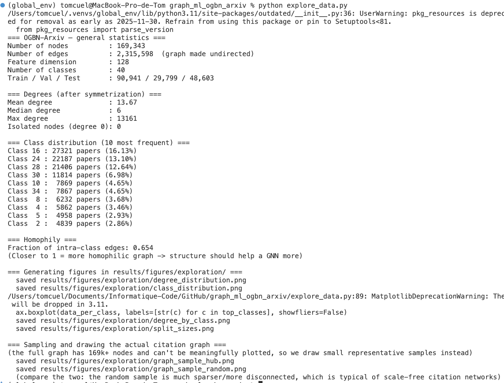
</p>

The overview highlights the dataset's long-tailed degree distribution, class imbalance
and variation in connectivity across categories.

<table>
  <tr>
    <td align="center" width="50%">
      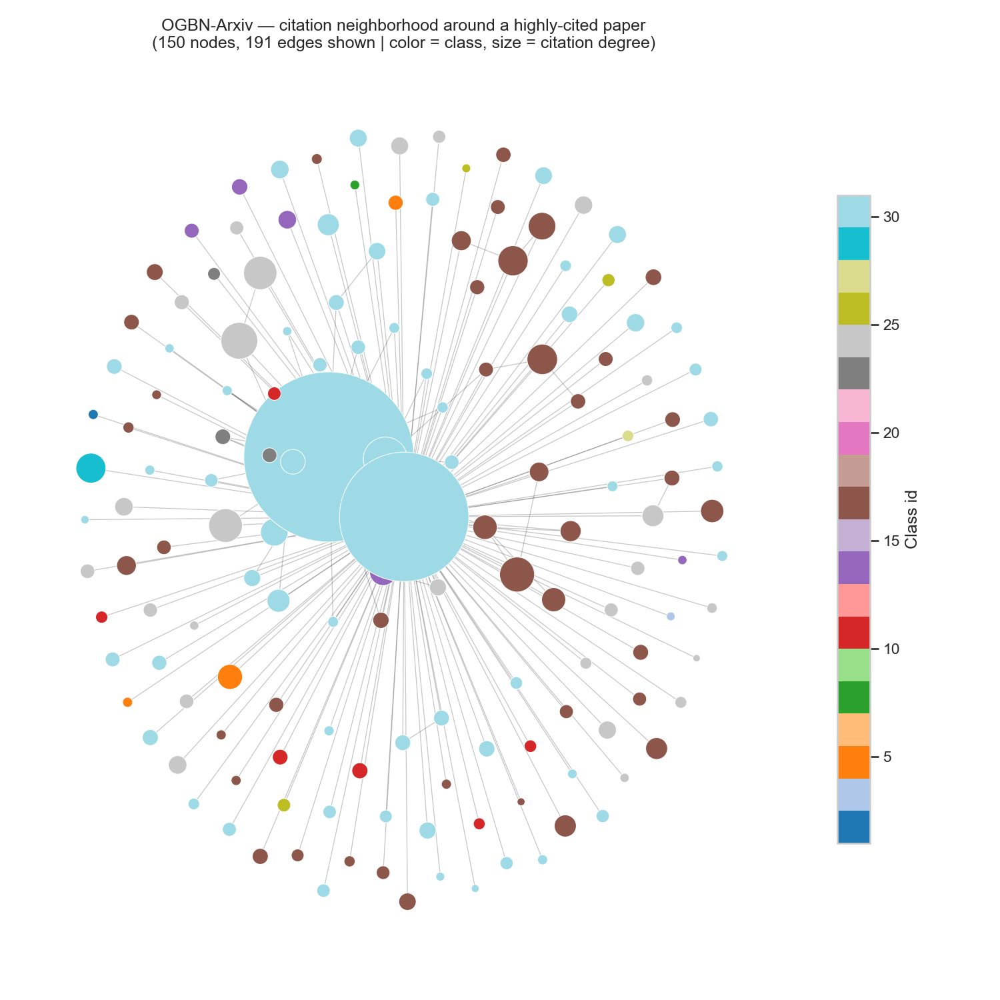
      <br><b>Citation graph — hub neighborhood</b></td>
    <td align="center" width="50%">
      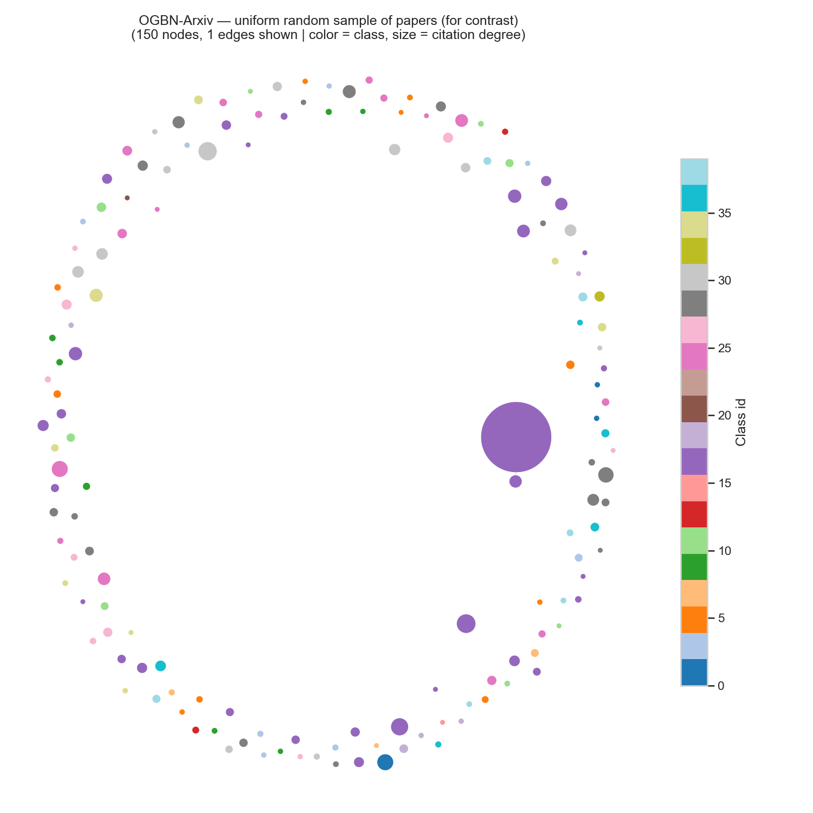
      <br><b>Citation graph — random sample</b></td>
  </tr>
</table>

The hub-centered sample illustrates how citations cluster around highly connected
papers while the random sample provides a less structured view of the graph.

<table>
  <tr>
  <td align="center" width="50%">
    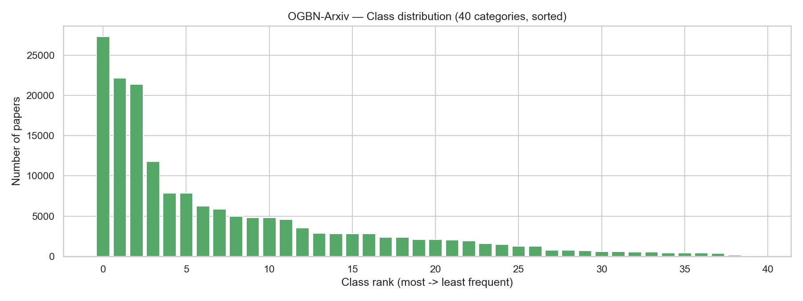
    <br><b>Class distribution</b></td>
  <td align="center" width="50%">
    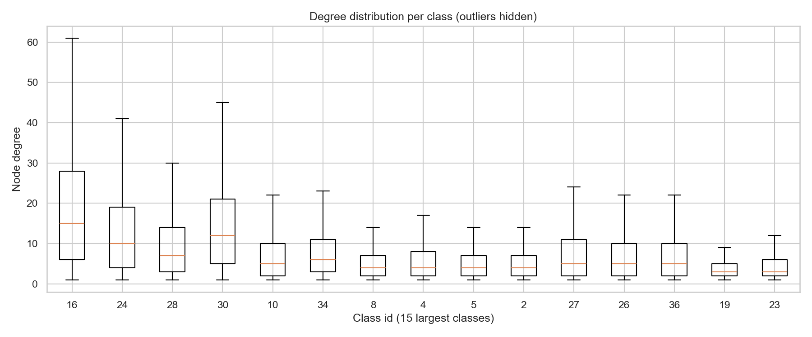
    <br><b>Degree by class</b></td>
  </tr>
</table>

<p align="center">
  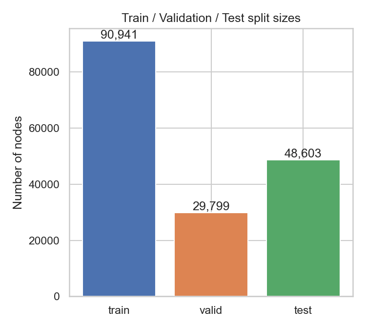
</p>

### 2. Run an experiment
```bash
# Experiment 1 - baseline (content only, no graph)
python run_experiment.py --model mlp

# Experiment 2 - GCN (content + graph)
python run_experiment.py --model gcn

# Experiment 3 - ResGCN (GCN + residual connections, mitigates over-smoothing)
python run_experiment.py --model resgcn

# Experiment 4 - GraphSAGE
python run_experiment.py --model sage

# Experiment 5 - GAT
python run_experiment.py --model gat
```
Each run:
- appends a row to `results/results.csv` (val/test accuracy)
- saves the full per-epoch history to `results/history/history_<model>_<features>_<number>.json`
- saves over-smoothing / over-squashing diagnostics to `results/diagnostics/diagnostics_<model>_<features>_<number>.json`
- **saves the trained model weights to `checkpoints/<model>_<features>_<number>.pt`**, along with its config and final scores, so you never have to retrain to reuse a model

| Flag | Default | Description |
|------|---------|-------------|
| `--model` | *required* | `mlp` \| `gcn` \| `resgcn` \| `sage` \| `gat` |
| `--number` | `1` | run index, lets you log multiple runs of the same config |
| `--features` | `full` | `full` \| `degree` \| `none` (see [ablation](#4-content-vs-structure-vs-contentstructure)) |
| `--hidden_channels` | `128` | hidden layer size |
| `--num_layers` | `3` | number of layers (input + hidden + output) |
| `--dropout` | `0.5` | dropout probability |
| `--num_heads` | `None` | attention heads, **GAT only** |
| `--lr` | `0.01` | learning rate |
| `--weight_decay` | `0.0` | L2 regularization |
| `--epochs` | `100` | max training epochs |
| `--patience` | `20` | early-stopping patience |
| `--seed` | `42` | random seed |
| `--num_pairs` | `10000` | node pairs sampled for the over-smoothing diagnostic |
| `--max_distance` | `5` | max hop distance probed for the over-squashing diagnostic |
| `--n_targets` | `20` | target nodes sampled for the over-squashing diagnostic |

See `python run_experiment.py -h` for the full list

<table>
  <tr>
    <td align="center" width="50%">
      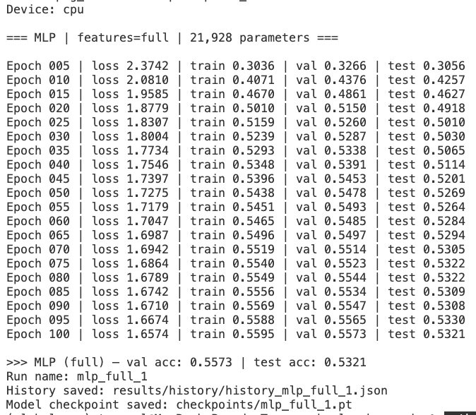
      <br><b>MLP training progress</b></td>
    <td align="center" width="50%">
      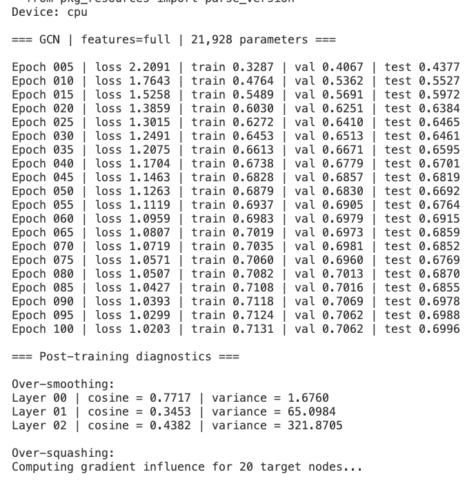
      <br><b>GCN training progress</b></td>
  </tr>
</table>

### 3. Reload a trained model
```bash
python load_checkpoint_example.py --checkpoint checkpoints/gat_full_1.pt
```
Loads the saved weights, rebuilds the exact architecture from the stored config and re-runs evaluation to confirm the scores match

### 4. Content vs. structure vs. content+structure

| Setting | Flag | What the model sees |
|---------|------|---------------------|
| Content only | `--model mlp` | features only, never the graph |
| Content + graph | `--model gcn/resgcn/sage/gat --features full` (default) | both |
| Structure only | `--model gcn/resgcn/sage/gat --features degree` | one-hot node degree, no content |
| Negative control | `--features none` | random noise, sanity check that nothing else is leaking signal |

```bash
python run_experiment.py --model sage --features degree
python run_experiment.py --model gcn --features none
```

### 5. Compare all results
```bash
python compare_results.py
```
Prints the comparison table (and save in `results/results.md`) and generates figures in `results/figures/comparison/`

<table>
  <tr>
    <td align="center" width="50%">
      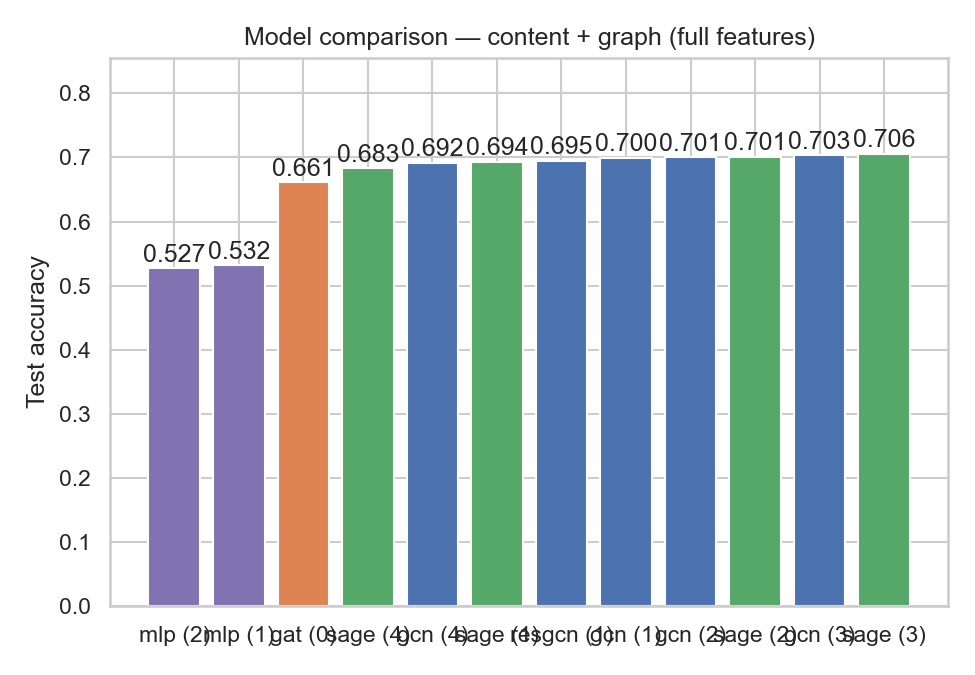
      <br><b>MLP vs GCN vs SAGE vs GAT (full features)</b></td>
    <td align="center" width="50%">
      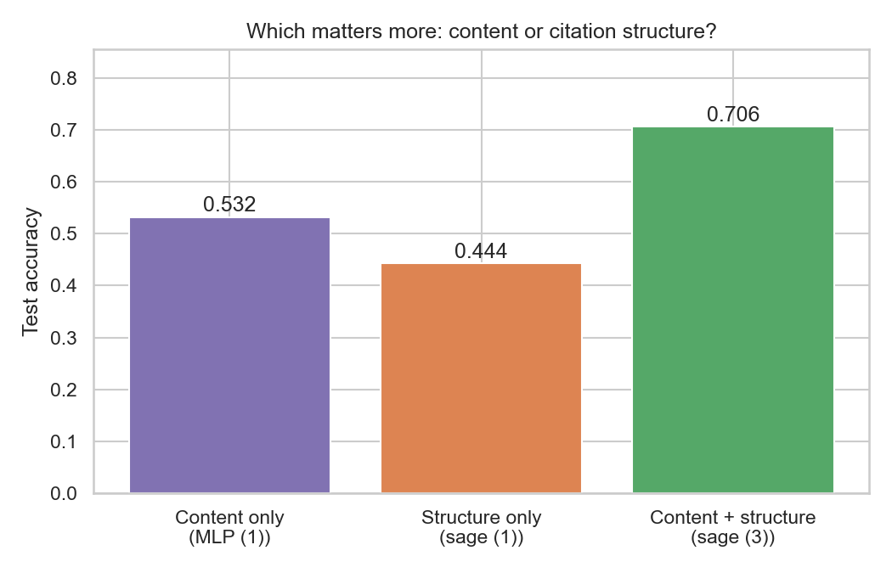
      <br><b>Content vs structure vs both</b></td>
  </tr>
  <tr>
    <td align="center" width="50%">
      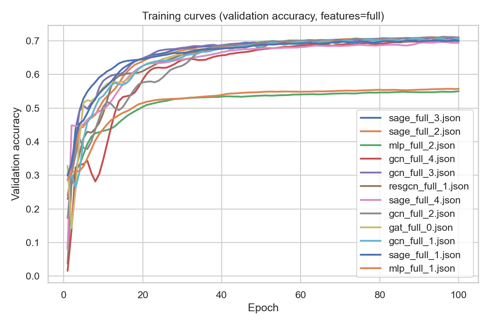
      <br><b>Training curves</b></td>
    <td align="center" width="50%">
      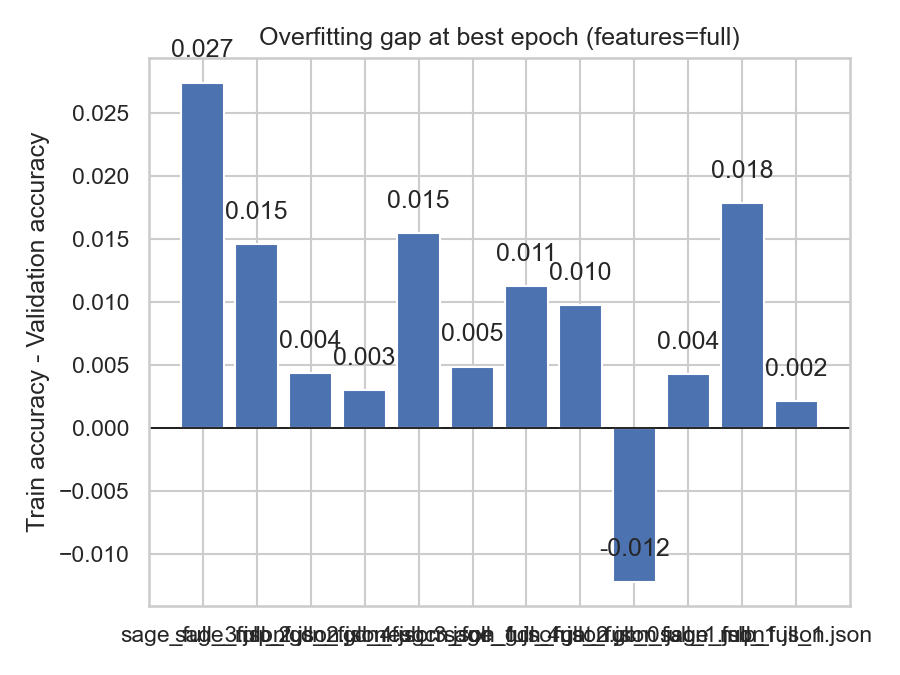
      <br><b>Overfitting gap (train − val acc)</b></td>
  </tr>
</table>

We can direclty see that **GNNs outperform the content-only MLP (70% vs 50%)**, and that content+structure is better than structure alone (44%).
The training curves and overfitting gap plots also help identify which architectures are more prone to overfitting or underfitting.

Here are below the over-smoothing and over-squashing diagnostics, which help explain *why* some architectures perform better than others. Over-smoothing measures how quickly node embeddings collapse to the same point as message passing depth increases, while over-squashing measures how much information from distant nodes actually reaches a target node through the graph's bottlenecks.

<table>
  <tr>
    <td align="center" width="50%">
      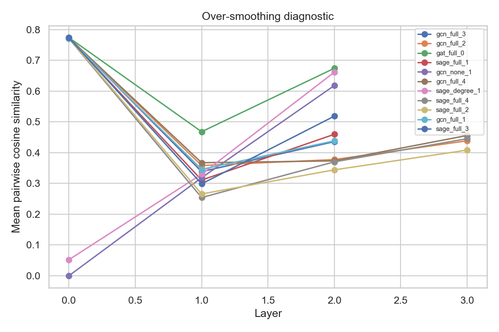
      <br><b>Over-smoothing diagnostic</b></td>
    <td align="center" width="50%">
      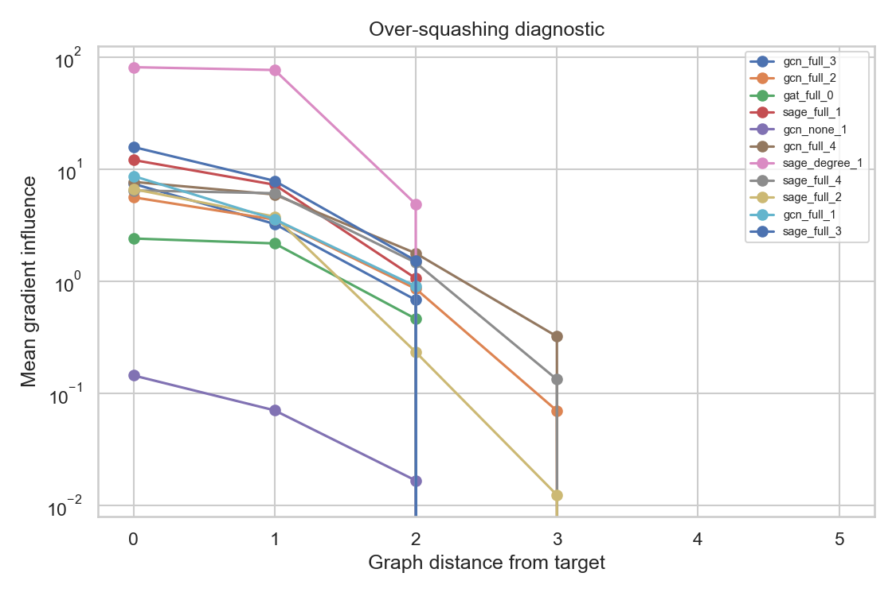
      <br><b>Over-squashing diagnostic</b></td>
  </tr>
</table>

---
# Results
All runs below use the same `epochs=100`, `patience=20`, `lr=0.01`, `dropout=0.5` for a fair comparison; only `hidden_channels` / `num_layers` (and optimizer/weight-decay tuning) vary across numbered runs of the same model.

| model | number | features | hidden_channels | num_layers | val_acc | test_acc |
|-------|--------|----------|-----------------|------------|---------|----------|
| **mlp** | **1** | **full** | **128** | **2** | **0.5573** | **0.5321** |
| mlp | 2 | full | 128 | 3 | 0.5503 | 0.5273 |
| gcn | 1 | full | 128 | 2 | 0.7074 | 0.6996 |
| **gcn** | **3** | **full** | **256** | **1** | **0.7091** | **0.7032** |
| gcn | 2 | full | 128 | 3 | 0.7123 | 0.7008 |
| gcn | 4 | full | 64 | 3 | 0.7005 | 0.6918 |
| resgcn | 1 | full | 128 | 2 | 0.7056 | 0.6947 |
| sage | 1 | full | 128 | 2 | 0.7023 | 0.6937 |
| sage | 2 | full | 128 | 3 | 0.7112 | 0.7011 |
| **sage** | **3** | **full** | **256** | **2** | **0.7108** | **0.7057** |
| sage | 4 | full | 64 | 3 | 0.6968 | 0.6832 |
| gat | 0 | full | 64 | 2 | 0.6599 | 0.6612 |
| sage | 1 | degree | 128 | 2 | 0.4552 | 0.4436 |
| gcn | 1 | none | 128 | 2 | 0.2037 | 0.2046 |

**Key takeaways**
- **Graph structure clearly helps**: every GNN beats the content-only MLP by roughly **+15 to +18 points** of test accuracy (~53–55% $\rightarrow$ ~68–71%)
- **GraphSAGE and GCN are the strongest performers** here (~70–71% test accuracy), with ResGCN close behind, GAT currently trails (~66%) and likely has headroom left with more head/layer tuning
- **Content still dominates structure alone**: position in the network is informative, but it's not a substitute for what the paper is actually about, a GNN with *only* degree information (no content) reaches ~44%, well above chance (2.5% for 40 classes) but far below the ~70% achieved with content, and clearly below even the plain MLP
- **The negative control (~20% test accuracy on random features) confirms the pipeline isn't leaking label information** some other way, GCN on pure noise still does a bit better than chance (2.5%) purely from label smoothing over the graph structure, but nowhere near the real-feature runs

---
# Implementation notes
- All runs share the same `epochs`, `patience`, `lr` and optimizer settings (AdamW, weight decay) for a fair architecture comparison, only `hidden_channels`, `num_layers`, and  are tuned per model (apart from GAT, which also has `num_heads`)
- The graph is **made undirected** (citation edges + their reverse): standard practice on OGBN-Arxiv since a paper is informed both by what it cites and by what cites it
- **Full-batch** training: the whole graph fits in memory at this scale (169k nodes × 128 features). For a much larger graph, swap this for `torch_geometric.loader.NeighborLoader` (mini-batch + neighbor sampling: the idea behind GraphSAGE)
- Early stopping on validation accuracy: the best checkpoint is kept and reloaded before saving
- Evaluation uses `ogb.nodeproppred.Evaluator`, the standardized OGB protocol, so scores are directly comparable to the [official leaderboard](https://ogb.stanford.edu/docs/leader_nodeprop/#ogbn-arxiv) (even if training has not been pushed to the limit with more epochs, a smaller learning rate, larger hidden sizes and more layers)
